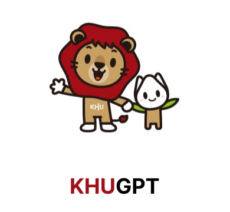

<!-- Improved compatibility of back to top link: See: https://github.com/othneildrew/Best-README-Template/pull/73 -->
<a name="readme-top"></a>
[![Contributors][contributors-shield]][contributors-url] [![Forks][forks-shield]][forks-url] [![Stargazers][stars-shield]][stars-url] [![Issues][issues-shield]][issues-url] [![Pull Request][pr-shield]][pr-url] [![MIT License][license-shield]][license-url]


<!-- PROJECT LOGO -->
<br />
<div align="center">
  <a href="https://github.com/FacerAin/khugpt-airflow">
    
  </a>

<h3 align="center">KHUGPT airflow Engine</h3>

  <p align="center">
  Data workflow for KHUGPT using airflow.
    <br />
    <br />
    <br />
    <br />
    <br />
    <a href="https://github.com/FacerAin/khugpt-airflow/issues">Report Issues</a>
    ·
    <a href="https://github.com/FacerAin/khugpt-airflow/pulls">Pull Requests</a>
  </p>
</div>


### :card_file_box: Built With
#### :bulb: Language
[![Python][Python]][Python-url]
#### :bulb: Frameworks
[![Airflow][Airflow]][Airflow-url]


<p align="right">(<a href="#readme-top">back to top</a>)</p>


<!-- GETTING STARTED -->
## :rocket: Getting Started

### :zap: Prerequisites
- [python v3.8+](https://www.python.org/)
- [docker v18+](https://www.docker.com/)

### 🚀 Guideline

I recommend building your environment on top of a **virtual environment** or **docker container**. (e.g., venv, anaconda, etc.)
* **Running Airflow locally**
  
  ```sh
  #start airflow
  make start-airflow

  #stop airflow
  make stop-airflow
  ```

* **Linting & Testing**
  
  ```sh
  # Linting
  make lint

  # Testing
  make test
  ```
* **Cleaning up your local environment**

  ```sh
  make reset-airflow
  ```


<p align="right">(<a href="#readme-top">back to top</a>)</p>


## :globe_with_meridians: Features
- Providing collectors for data collection
- Loading into NoSQL (e.g., MongoDB)
- Trasform and load for loading into Vector Store (e.g., Pinecone)

<p align="right">(<a href="#readme-top">back to top</a>)</p>

<!-- CONTRIBUTING -->
## :fire: Contributing
Please refer to [CONTRIBUTING.md](https://github.com/FacerAin/khugpt-airflow/blob/main/CONTRIBUTING.md) for Contribution.

For issues, new functions and requests to modify please follow the following procedure. 🥰

1. Fork the Project
2. Create a Issue when you have new feature or bug, just not Typo fix
3. Create your Feature Branch from dev Branch (`git checkout -b feat/Newfeature`)
4. Commit your Changes (`git commit -m 'feat: add new feature'`)
5. Push to the Branch (`git push origin feat/Newfeature`)
6. Open a Pull Request to dev branch with Issues

<p align="right">(<a href="#readme-top">back to top</a>)</p>


<!-- LICENSE -->
## :closed_lock_with_key: License
Please refer to `LICENSE` for LICENSE.
<p align="right">(<a href="#readme-top">back to top</a>)</p>


<!-- CONTACT -->
## :speech_balloon: Contact

<table>
  <tbody>
    <tr>
      <td align="center"><a href="https://github.com/FacerAin"><br /><sub><b>Yongwoo Song</b></sub></a></td>
    </tr>
  </tobdy>
</table>

<p align="right">(<a href="#readme-top">back to top</a>)</p>


<!-- MARKDOWN LINKS & IMAGES -->
<!-- https://www.markdownguide.org/basic-syntax/#reference-style-links -->
[contributors-shield]: https://img.shields.io/github/contributors/FacerAin/khugpt-airflow.svg?style=flat
[contributors-url]: https://github.com/FacerAin/khugpt-airflow/graphs/contributors
[forks-shield]: https://img.shields.io/github/forks/FacerAin/khugpt-airflow.svg?style=flat
[forks-url]: https://github.com/FacerAin/khugpt-airflow/network/members
[stars-shield]: https://img.shields.io/github/stars/FacerAin/khugpt-airflow.svg?style=flat
[stars-url]: https://github.com/FacerAin/khugpt-airflow/stargazers
[issues-shield]: https://img.shields.io/github/issues/FacerAin/khugpt-airflow.svg?style=flat
[issues-url]: https://github.com/FacerAin/khugpt-airflow/issues
[pr-url]: https://github.com/FacerAin/khugpt-airflow/pulls
[pr-shield]: https://img.shields.io/github/issues-pr/FacerAin/khugpt-airflow.svg?style=flat
[license-shield]: https://img.shields.io/github/license/FacerAin/khugpt-airflow.svg?style=flat
[license-url]: https://github.com/FacerAin/khugpt-airflow/blob/master/LICENSE.txt

[Python]: https://img.shields.io/badge/Python-14354C?style=for-the-badge&logo=python&logoColor=white
[Python-url]: https://www.python.org/

[Fastapi]: https://img.shields.io/badge/FastAPI-005571?style=for-the-badge&logo=fastapi
[Fastapi-url]: https://fastapi.tiangolo.com/ko/

[Airflow]: https://img.shields.io/badge/apacheairflow-017CEE?style=for-the-badge&logo=apacheairflow
[Airflow-url]: https://airflow.apache.org/


[Yarn]: https://img.shields.io/badge/yarn-%232C8EBB.svg?style=flat&logo=yarn&logoColor=white
[Yarn-url]: https://yarnpkg.com/
[ESLint]: https://img.shields.io/badge/ESLint-4B3263?style=flat&logo=eslint&logoColor=white
[ESLint-url]: https://eslint.org/
[Vue]: https://img.shields.io/badge/Vue.js-35495E?style=flat&logo=vuedotjs&logoColor=white
[Vue-url]: https://vuejs.org/
[Go]: https://img.shields.io/badge/Go-00ADD8?style=flat&logo=Go&logoColor=white
[Go-url]: https://go.dev/
[Terraform]: https://img.shields.io/badge/Terraform-430098?style=flat&logo=Terraform&logoColor=white
[Terraform-url]: https://www.terraform.io/
[aws]: https://img.shields.io/badge/AmazonAWS-232F3E?style=flat&logo=AmazonAWS&logoColor=white
[aws-url]: https://aws.amazon.com/
[OCI]: https://img.shields.io/badge/Oracle-F80000?style=flat&logo=oracle&logoColor=black
[OCI-url]: https://www.oracle.com/kr/cloud/
[Kubernetes]: https://img.shields.io/badge/Kubernetes-326CE5?style=flat&logo=Kubernetes&logoColor=white
[Kubernetes-url]: https://kubernetes.io/ko/
[Github-actions]: https://img.shields.io/badge/GitHub_Actions-2088FF?style=flat&logo=github-actions&logoColor=white
[Github-actions-url]: https://github.com/features/actions
[Helm]: https://img.shields.io/badge/Helm-326CE5?style=flat&logo=Helm&logoColor=white
[Helm-url]: https://helm.sh/
[Accordian]: https://img.shields.io/badge/Accordian-430098?style=flat&logo=Accordian&logoColor=white
[Accordian-url]: https://accordions.co.kr/
